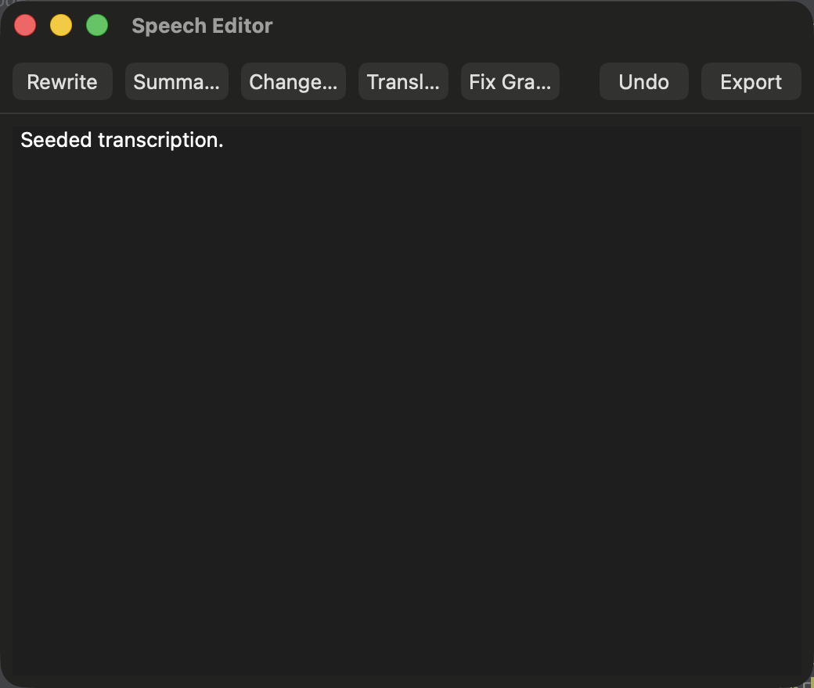
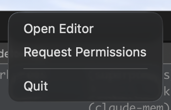

# Voice to Text Speech Editor

A native macOS menu-bar dictation app with a first-class **Editor** — not just a paste step. Hold **⌃ Right-Control**, speak, release: your words are transcribed on-device, optionally cleaned up by an AI pass, pasted at the cursor, and collected in a dedicated Editor window for rewriting, summarizing, translating, and export.

Inspired structurally by [VoiceInk](https://github.com/sadiuysal/VoiceInk), but rebuilt on a clean, protocol-seamed architecture where the transcription engine and AI provider are swappable behind narrow protocols.

---

## What it looks like

```
  menu bar  ▸  🎤 Speech Editor ▾
              ├─ Open Editor
              ├─ Request Permissions
              └─ Quit

  hold ⌃ Right-Control          ┌─────────────────────────┐
        ▼                       │  ● Recording…           │   ← floating HUD
   speak… release               └─────────────────────────┘     (shown while held)
        ▼
  ┌──────────────────────────────────────────────────────────┐
  │  Rewrite  Summarize  Change Tone  Translate  Fix Grammar  │   ← Editor toolbar
  │  ──────────────────────────────────  Undo   Export        │
  ├──────────────────────────────────────────────────────────┤
  │  Hello, world. This is my dictated text, cleaned up and   │   ← editable canvas
  │  ready to rewrite or export as Markdown.                  │
  └──────────────────────────────────────────────────────────┘
```

**The Editor window** (AI actions, editable canvas, undo + Markdown export):



**The menu-bar menu** (the app runs as an `LSUIElement` agent):



> The floating "Recording…" HUD (shown in the diagram above) appears only while the
> ⌃ Right-Control hotkey is held, which requires the Accessibility grant — capture it
> live during the [MANUAL_QA.md](MANUAL_QA.md) pass.

---

## Tech Stack

| Layer | Technology |
|-------|-----------|
| UI | SwiftUI + AppKit (menu-bar agent, `LSUIElement`) |
| Architecture | Protocol-seamed pipeline + `@MainActor` |
| Transcription | Apple **Speech** framework (`SFSpeechRecognizer`, on-device) |
| AI cleanup / editing | Ollama (local, default) · OpenAI (fallback) |
| Audio | AVAudioEngine (16 kHz mono capture) |
| Hotkey | Global `NSEvent` monitor — hold ⌃ Right-Control |
| Project | XcodeGen (`project.yml`) |
| Tests | Swift Testing (unit) + XCUITest (UI) |
| Min OS | macOS 14 |

---

## The hotkey

**Hold ⌃ Right-Control to dictate.** Recording runs only while the key is held; releasing it ends the capture. This is intentionally distinct from the separate `ai-voice-dictation` project's **⌥ Option** hotkey, so the two never collide.

---

## Architecture

### The pipeline (every layer is a protocol + concrete impl + test fake)

```
HotkeyManager ──hold ⌃RCtrl──▶ AudioCapturing ──AudioBuffer──▶ TranscriptionEngine
 (state machine)               (AVAudioCaptureService)          (AppleSpeechEngine)
                                                                     │ raw text
                                                                     ▼
                                                              TextEnhancer
                                                       (OllamaEnhancer / OpenAIEnhancer)
                                                          │                    │
                                                  OutputSink            EditorStore ──▶ EditorWindow
                                              (CursorPasteSink)         (undo history,    (AI actions,
                                               paste at cursor +         md export)         export)
                                               restore clipboard
                                                          ▲
                                              DictationController (@MainActor)
                                                  orchestrates the whole chain
```

Each arrow is a narrow protocol seam, so any layer swaps without touching the rest. The whole pipeline is unit-tested end-to-end with fakes — no real audio, network, or models required.

### Dictation flow

```
Hold ⌃ Right-Control
    │  HotkeyStateMachine.keyChanged(isControlDown: true)
    ▼
CaptureService.start()            ← floating "Recording…" HUD shown
    │  user speaks
    ▼
Release ⌃ Right-Control
    │  CaptureService.stop() → AudioBuffer (16 kHz)
    ▼
guard !buffer.isTooShort         ← <0.3 s is ignored (no crash, no-op)
    │
    ▼
AppleSpeechEngine.transcribe(buffer, vocabulary)   → raw text
    │
    ├─ settings.enhancementEnabled?
    │       └─ TextEnhancer.clean(raw)  (try?, best-effort)  → enhanced
    │
    ▼
store.add(Transcript(raw, enhanced))   ← stored FIRST (never lose words)
    │
    ▼
CursorPasteSink.deliver(enhanced ?? raw)
    save clipboard → set text → ⌘V → restore clipboard
```

### Editor actions

```
EditorWindow  (TextEditor bound to EditorStore.currentText)
    │  user taps an action
    ▼
TextEnhancer.apply(action, to: currentText)
    ├─ Rewrite      clearer & more concise, meaning preserved
    ├─ Summarize    condense to a few sentences
    ├─ Change Tone  professional, friendly
    ├─ Translate    → Spanish
    └─ Fix Grammar  grammar/spelling only
    ▼
EditorStore.replaceCurrent(with: result)   ← pushes undo history
                              │
                    Undo ◀────┘     Export ──▶ Markdown (.md) via NSSavePanel
```

---

## Project Structure

```
SpeechEditor/
├── App/
│   ├── SpeechEditorApp.swift     ← @main, MenuBarExtra + Settings scene
│   ├── AppDelegate.swift          ← lifecycle, first-run onboarding, UI-test seed
│   ├── AppContainer.swift         ← composition root (DI)
│   └── WindowManager.swift        ← AppKit windows for Editor / Onboarding
├── Capture/
│   ├── AudioCapturing.swift       ← protocol + AudioBuffer
│   └── AVAudioCaptureService.swift
├── Transcription/
│   ├── TranscriptionEngine.swift  ← protocol
│   ├── AppleSpeechEngine.swift    ← SFSpeechRecognizer impl
│   └── ModelManager.swift         ← whisper.cpp model catalog (latent, see notes)
├── Enhancement/
│   ├── TextEnhancer.swift         ← protocol + EditorAction
│   ├── OllamaEnhancer.swift       ← local, default
│   ├── OpenAIEnhancer.swift       ← fallback
│   └── PromptLibrary.swift
├── Output/
│   ├── OutputSink.swift           ← protocol
│   └── CursorPasteSink.swift      ← clipboard save → ⌘V → restore
├── Pipeline/
│   ├── HotkeyManager.swift        ← hold ⌃ Right-Control state machine
│   └── DictationController.swift  ← orchestrates the pipeline
├── Editor/
│   ├── EditorStore.swift          ← transcripts, undo history, md export
│   ├── EditorWindow.swift
│   └── EditorToolbar.swift
├── Settings/
│   ├── SettingsStore.swift        ← UserDefaults persistence
│   └── SettingsView.swift
├── Onboarding/
│   ├── PermissionsService.swift   ← mic + speech + accessibility
│   └── OnboardingView.swift       ← first-run flow
├── HUD/
│   ├── HUDController.swift         ← floating NSPanel
│   └── MiniRecorderHUD.swift
├── Models/         Transcript, AppSettings, VocabularyEntry
├── Shared/         AppError, Logger
└── Resources/      Info.plist
SpeechEditorTests/  Swift Testing units + Fakes/
SpeechEditorUITests/ Editor smoke UITest
```

---

## Setup

### Prerequisites

- macOS 14+, Xcode 16+
- [XcodeGen](https://github.com/yonaskolb/XcodeGen): `brew install xcodegen`
- **Optional:** [Ollama](https://ollama.com) running locally for AI cleanup (`ollama serve`, model `qwen2.5:7b-instruct`)
- **Optional:** `OPENAI_API_KEY` env var to use OpenAI instead of Ollama

### Steps

```bash
git clone <repo>
cd Voice-To-Text-Speech-Editor

xcodegen generate          # regenerates SpeechEditor.xcodeproj
open SpeechEditor.xcodeproj # ⌘R to run
```

On first run the app shows an onboarding window requesting **Microphone**, **Speech Recognition**, and **Accessibility** permissions (Accessibility is required for the global hotkey and paste-at-cursor). You can re-request any time via the menu's **Request Permissions** item.

> **Without Ollama running** and no `OPENAI_API_KEY`, the AI cleanup pass simply no-ops — the raw transcript is still delivered and stored, so the app stays usable.

---

## Running Tests

```bash
# Unit tests (Swift Testing) — 35 tests
xcodebuild test \
  -scheme SpeechEditor \
  -destination 'platform=macOS,arch=arm64' \
  -only-testing:SpeechEditorTests

# Build only
xcodebuild build -scheme SpeechEditor -destination 'platform=macOS,arch=arm64'
```

> Pipe to [`xcbeautify`](https://github.com/cpisciotta/xcbeautify) for prettier output (optional). When filtering with `-only-testing`, use the test **type name** (`-only-testing:SpeechEditorTests/SmokeTests`), not the `@Suite` display name — filtering by display name silently runs zero tests.

### Test strategy

```
Unit tests (35, Swift Testing)            UI test (1, XCUITest)
──────────────────────────────────       ─────────────────────────
TranscriptTests   AppSettingsTests        EditorSmokeUITests
AudioBufferTests  TranscriptionContract     (launches with
TextEnhancer/Prompt/Ollama/OpenAI          -uiTestSeedEditor,
OutputSink/CursorPasteSink                 asserts seeded editor)
HotkeyStateMachine                              │
DictationController (happy / too-short /        │ skips in headless
  enhancement-off / enhance-fails-keeps-raw)    │ CI (XCUITest can't
EditorStore  SettingsStore  PermissionsService  │ grant automation
                  │                             │ non-interactively)
            Fakes for every protocol            │ — runs in a normal
       (Audio/Transcription/Enhancer/Sink)      ▼ Xcode session
```

The transcription, AI, and paste steps are **build-verified** in CI and exercised by the human-run [MANUAL_QA.md](MANUAL_QA.md) checklist — they need real audio, permissions, and a running Ollama, which unit tests deliberately don't.

---

## Implementation notes

The original plan was to use **whisper.cpp** for local transcription. On the current toolchain (Xcode 26.5) it could not be integrated as a Swift Package Manager source dependency — tags ≤1.7.2 use unsafe build flags that Xcode rejects in app targets, 1.7.3/1.7.4 require a system-installed lib via pkg-config, and ≥1.7.5 dropped `Package.swift` entirely. Rather than block the MVP, transcription ships on **Apple's on-device Speech framework** behind the unchanged `TranscriptionEngine` protocol. Because that seam is narrow, whisper.cpp can be added later via a vendored `.xcframework` without touching the rest of the pipeline — the `ModelManager` type is already present for that path.

See [docs/superpowers/specs/](docs/superpowers/specs/) for the design spec and [docs/superpowers/plans/](docs/superpowers/plans/) for the phased implementation plan this was built from.

---

## License

GPLv3. See [LICENSE](LICENSE).
